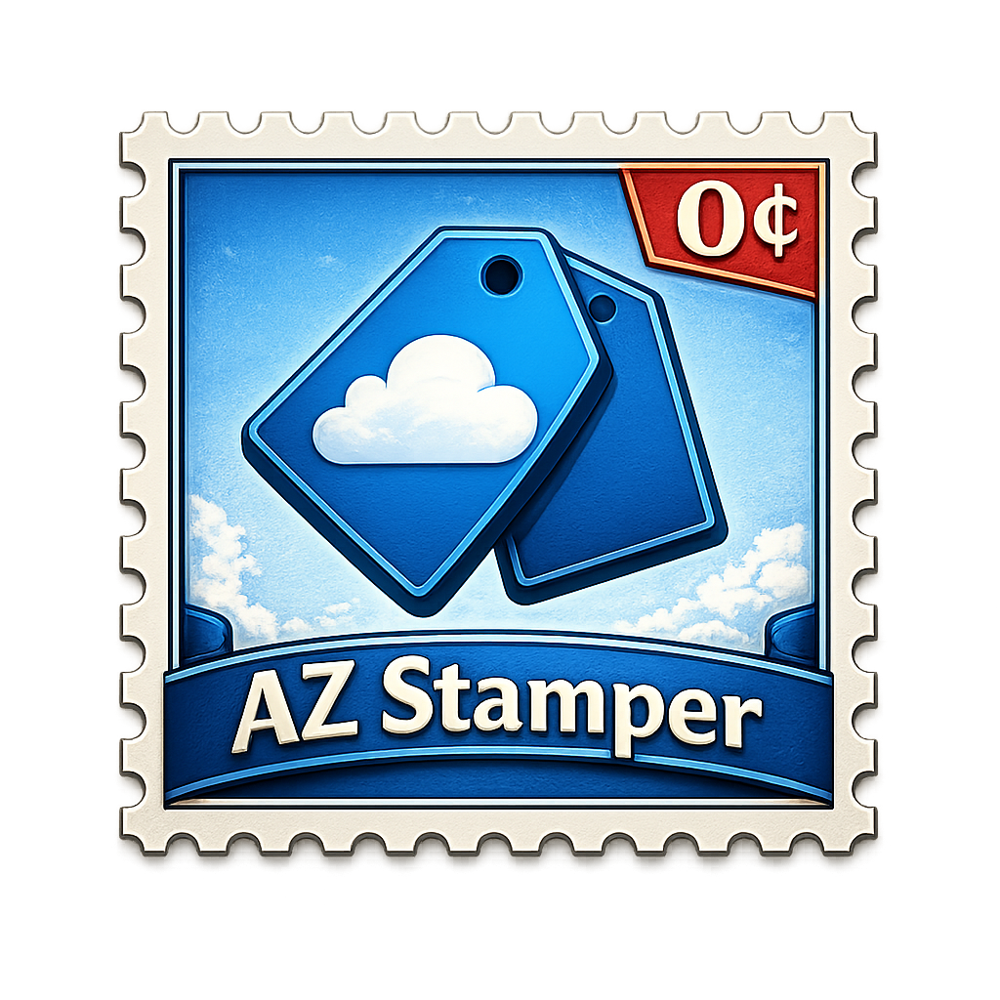

<p align="center">
  
</p>

<h1 align="center">Az-Stamper</h1>

<p align="center">
  <a href="https://github.com/Galvnyz/Az-Stamper/actions/workflows/ci.yml"></a>
  <a href="https://github.com/Galvnyz/Az-Stamper/releases/latest"></a>
  <a href="https://github.com/Galvnyz/Az-Stamper/releases"></a>
  <a href="https://github.com/Galvnyz/Az-Stamper"></a>
  <a href="https://github.com/Galvnyz/Az-Stamper/blob/main/LICENSE"></a>
  <a href="https://github.com/Galvnyz/Az-Stamper/stargazers"></a>
</p>

<p align="center">
  <a href="https://portal.azure.com/#create/Microsoft.Template/uri/https%3A%2F%2Fraw.githubusercontent.com%2FGalvnyz%2FAz-Stamper%2Fmain%2Finfra%2Fdeploy.json"></a>
  &nbsp;
  <a href="https://portal.azure.com/#create/Microsoft.Template/uri/https%3A%2F%2Fraw.githubusercontent.com%2FGalvnyz%2FAz-Stamper%2Fmain%2Finfra%2Fenroll.json"></a>
</p>

---

## Table of Contents

- [What It Does](#what-it-does)
- [How It Works](#how-it-works)
- [Architecture](#architecture)
- [Configuration](#configuration)
  - [How Tags Are Configured](#how-tags-are-configured)
  - [Template Variables](#template-variables)
  - [Adding a New Tag](#adding-a-new-tag)
  - [Ignore Patterns](#ignore-patterns)
  - [Caller Identity Resolution](#caller-identity-resolution)
- [Deployment](#deployment)
  - [Deploy to Azure](#deploy-to-azure)
  - [Developer Setup (CI/CD)](#developer-setup-cicd)
- [Permissions](#permissions)
- [Multi-Subscription Enrollment](#multi-subscription-enrollment)
- [CI/CD](#cicd)
- [Development](#development)
- [Cost](#cost)
- [License](#license)

---

Az-Stamper solves a fundamental Azure governance problem: **it's surprisingly hard to know who created a resource.**

When you create a VM, storage account, or any other resource in Azure, you don't interact with the resource directly. Instead, your request goes through **Azure Resource Manager (ARM)** — the control plane that handles all resource operations. ARM authenticates your identity, validates your permissions, and executes the deployment. The actual creator information lives in ARM's activity log as a claim on the API call, but:

- **Activity logs expire after 90 days** — after that, the creator information is gone forever
- **The creator isn't visible on the resource itself** — you have to dig through logs to find it
- **ARM deployments obscure the real caller** — if a user deploys via a pipeline, the activity log shows the pipeline's Service Principal, not the human who triggered it
- **There's no built-in "created by" property** on Azure resources

Az-Stamper fixes this by intercepting the ARM event at creation time and writing the caller's identity directly onto the resource as **tags** — key-value labels that are permanently attached to the resource, visible in the portal, queryable in Azure Resource Graph, and included in billing exports.

## What It Does

When someone (or something) creates or modifies an Azure resource, Azure generates an event. Az-Stamper listens for these events and immediately stamps the resource with tags like:

| Tag | Example Value | What It Tells You |
|-----|--------------|-------------------|
| **Creator** | `alice@contoso.com` | Who originally created this resource |
| **CreatedOn** | `2026-03-28T10:17:41Z` | When it was created |
| **LastModifiedBy** | `bob@contoso.com` | Who last changed it |
| **LastModifiedOn** | `2026-03-28T14:32:15Z` | When it was last changed |
| **StampedBy** | `Az-Stamper` | Confirms automated tagging is working |

The `Creator` and `CreatedOn` tags are set once and never overwritten — even if the resource is modified later, you always know who originally created it. The `LastModifiedBy` and `LastModifiedOn` tags update on every change, giving you a running record of who touched it last.

## How It Works

Az-Stamper uses three Azure services working together:

```
1. Someone creates a VM, storage account, or any Azure resource
        ↓
2. Azure Event Grid notices and sends a "ResourceWriteSuccess" event
        ↓
3. Az-Stamper (an Azure Function) receives the event, reads who
   triggered it, and writes tags onto the resource
```

**Azure Event Grid** is a messaging service built into Azure. It watches for things happening in your subscription (resources created, deleted, modified) and can route those events to handlers. Az-Stamper registers as a handler for `ResourceWriteSuccess` events — the event type Azure fires whenever a resource is created or updated successfully.

**Azure Functions** is a serverless compute service — you deploy code that runs only when triggered, and you pay only for the time it executes. Az-Stamper uses a **Flex Consumption** plan, which means it scales to zero when idle (costing nothing) and spins up automatically when an event arrives. For a typical dev/test subscription, the monthly cost is effectively zero (well within Azure's free grant of 1 million executions/month).

**Managed Identity** is how the function authenticates to Azure without passwords or API keys. When deployed, the function app gets a system-assigned identity (like a service account) that Azure manages automatically. Bicep assigns this identity the permissions it needs: `Tag Contributor` to write tags, and `Reader` to look up who Service Principals are.

## Architecture

```
Azure Subscription
  │
  ├─ Event Grid System Topic (watches for resource events)
  │     │
  │     └─ Event Subscription (filters ResourceWriteSuccess → sends to Function)
  │
  └─ Resource Group: rg-az-stamper-dev
        │
        ├─ Function App (Flex Consumption, .NET 8, Linux)
        │     └─ ResourceStamper function (Event Grid trigger)
        │
        ├─ Storage Account (function runtime, managed identity auth)
        ├─ App Service Plan (Flex Consumption — serverless)
        ├─ Application Insights (monitoring & logging)
        └─ Log Analytics Workspace (centralized log storage)
```

All infrastructure is defined as **Bicep** templates (Azure's infrastructure-as-code language). This means the entire deployment is repeatable, version-controlled, and reviewable — no portal clicking required.

## Configuration

### How Tags Are Configured

Tags are controlled entirely through the Function App's **application settings** (environment variables). You don't need to change any code to add, remove, or modify tags. Each tag requires two settings:

```
StamperConfig__TagMap__<TagName>__Value     = <template or literal>
StamperConfig__TagMap__<TagName>__Overwrite = true | false
```

- **Value** is what gets written to the tag. It can be a literal string like `Az-Stamper` or a template variable like `{caller}`.
- **Overwrite** controls whether the tag updates on subsequent resource modifications. Set to `false` for "set once" tags (like Creator), `true` for "always update" tags (like LastModifiedBy).

### Template Variables

These placeholders get replaced with real values when the tag is written:

| Variable | Resolves To | Example |
|----------|-------------|---------|
| `{caller}` | The identity that triggered the event | `alice@contoso.com` or `MyServicePrincipal` |
| `{timestamp}` | Current UTC time in ISO 8601 format | `2026-03-28T10:17:41Z` |
| `{principalType}` | Whether the caller is a user or automation | `User` or `ServicePrincipal` |
| Anything else | Used as-is (literal value) | `Az-Stamper`, `Finance`, `Production` |

### Adding a New Tag

To add a `Department` tag that gets set once and never changes:

```
StamperConfig__TagMap__Department__Value     = Engineering
StamperConfig__TagMap__Department__Overwrite = false
```

You can set these in the Azure Portal (Function App → Configuration → Application settings) or add them to the Bicep template in `infra/modules/functionApp.bicep`.

### Ignore Patterns

Some resource types should never be tagged. For example, tagging a "tag" resource would create an infinite loop (tag write → event → tag write → event...). The ignore list prevents this:

```
StamperConfig__IgnorePatterns__0 = Microsoft.Resources/deployments
StamperConfig__IgnorePatterns__1 = Microsoft.Resources/tags
StamperConfig__IgnorePatterns__2 = Microsoft.Network/frontdoor
```

If Az-Stamper is tagging a resource type you want to exclude, add another entry with the next index number (e.g., `__3`). The value is matched against the resource's provider path — for example, `Microsoft.Compute/virtualMachines` would skip all VMs.

### Caller Identity Resolution

When a user creates a resource, their UPN (e.g., `alice@contoso.com`) is embedded in the event and used directly. When automation (a Service Principal or Managed Identity) creates a resource, Az-Stamper attempts to look up its friendly display name via the Microsoft Graph API. If that fails (missing permissions), it falls back to the raw principal ID (a GUID). To enable display name resolution, grant the function's managed identity the `Directory.Read.All` Graph API permission (see Step 7 in deployment).

## Deployment

### Deploy to Azure

Deployment is two steps: **deploy the hub**, then **enroll each subscription** you want to tag.

> **Why two steps?** The hub deployment creates the function app and infrastructure, but does **not** automatically enroll any subscription for tagging. This is intentional — it gives you full control over which subscriptions get monitored and when. You explicitly enroll each subscription you want tagged, including your home subscription. This separation also avoids the Event Grid cold-start race condition (the function needs time to start before Event Grid can validate its endpoint).

**Prerequisites:**
- An Azure subscription with **Owner** or **Contributor + User Access Administrator** role
- The `Microsoft.EventGrid` resource provider registered on the subscription (`az provider register --namespace Microsoft.EventGrid`)

#### Step 1: Deploy the hub

[](https://portal.azure.com/#create/Microsoft.Template/uri/https%3A%2F%2Fraw.githubusercontent.com%2FGalvnyz%2FAz-Stamper%2Fmain%2Finfra%2Fdeploy.json)

1. Click the **Deploy Hub to Azure** button
2. The Azure portal opens a **Custom deployment** form. Fill in the required fields:
   - **Region** — pick the Azure region closest to you (e.g., East US 2, West Europe)
   - **Resource Group Name** — a name for the new resource group (default: `rg-az-stamper`)
   - **Storage Account Name** — must be **globally unique**, 3-24 lowercase letters and numbers only (e.g., `stazstamper42`)
   - **Function App Name** — name for the function app (default: `func-az-stamper`)
   - **App Insights Name** — name for Application Insights (default: `ai-az-stamper`)
3. Click **Review + create**, then **Create**
4. Deployment takes **3-5 minutes**. Wait for it to complete before proceeding to Step 2.

#### Step 2: Enroll your subscription

Enroll your subscription to start tagging. The template waits for the function to finish loading before creating the Event Grid subscription, so you can run this immediately after Step 1 completes.

[](https://portal.azure.com/#create/Microsoft.Template/uri/https%3A%2F%2Fraw.githubusercontent.com%2FGalvnyz%2FAz-Stamper%2Fmain%2Finfra%2Fenroll.json)

The enrollment template automatically looks up your function app — just confirm the **Resource Group Name** and **Function App Name** match what you used in Step 1 (defaults work if you didn't change them). This creates the Event Grid system topic and event subscription that routes resource events to your function.

#### Step 3: Verify it works

After both deployments complete, create a test resource and check for tags:

```bash
# Open Azure Cloud Shell (the terminal icon >_ in the portal header) and run:

# Create a test storage account (use your resource group name)
az storage account create \
  --name stazstampertest$RANDOM \
  --resource-group rg-az-stamper \
  --sku Standard_LRS

# Wait 60-90 seconds for the event to flow through (first invocation has a cold start)

# Check the tags (replace the resource ID with yours from the create output)
az tag list --resource-id <resource-id-from-create-output>
```

You should see all five tags: `Creator`, `CreatedOn`, `LastModifiedBy`, `LastModifiedOn`, `StampedBy`.

#### Optional: set SelfPrincipalId

This is a defense-in-depth measure that prevents the function from processing its own tag operations. Event Grid filters already prevent recursive loops, so this step is optional.

Open **Azure Cloud Shell** (the `>_` icon in the portal header) and run:

```bash
PRINCIPAL_ID=$(az functionapp identity show --name <your-function-app> --resource-group <your-rg> --query principalId -o tsv)
az functionapp config appsettings set --name <your-function-app> --resource-group <your-rg> --settings "StamperConfig__SelfPrincipalId=$PRINCIPAL_ID"
```

**After deployment**, resources begin tagging automatically. To enroll additional subscriptions, see [Multi-Subscription Enrollment](#multi-subscription-enrollment).

---

### Developer Setup (CI/CD)

If you're contributing to Az-Stamper or want to deploy via GitHub Actions CI/CD instead of the one-click button, you'll need these tools:

| Tool | What It's For | Install |
|------|---------------|---------|
| **Azure CLI** | Deploy infrastructure and manage Azure resources | [Install](https://learn.microsoft.com/en-us/cli/azure/install-azure-cli) |
| **Bicep** | Azure's infrastructure-as-code language (used by our templates) | `az bicep install` (included with Azure CLI) |
| **Azure Functions Core Tools v4** | Build and deploy the function code | [Install](https://learn.microsoft.com/en-us/azure/azure-functions/functions-run-local) |
| **.NET 8 SDK** | Build the C# function project | [Install](https://dotnet.microsoft.com/download/dotnet/8.0) |
| **Azure PowerShell** (Az module) | Create the Entra ID app registration and RBAC assignments | `Install-Module Az -Scope CurrentUser` |

You also need an Azure subscription where you have **Owner** or **Contributor + User Access Administrator** permissions.

### Step 1: Create an Entra ID App Registration

GitHub Actions needs a way to authenticate to Azure to deploy code and infrastructure. Instead of storing passwords as secrets, we use **OIDC federated credentials** — GitHub proves its identity to Azure using a token, and Azure trusts it based on a pre-configured trust relationship. No secrets to rotate.

> **First time?** Make sure you have the Az PowerShell module installed: `Install-Module Az -Scope CurrentUser`

```powershell
Connect-AzAccount

# Create the app registration (like a service account for deployments)
$app = New-AzADApplication -DisplayName "Az-Stamper-Deploy"
$sp = New-AzADServicePrincipal -ApplicationId $app.AppId

# Tell Azure to trust GitHub Actions for the "dev" environment
New-AzADAppFederatedCredential -ApplicationObjectId $app.Id `
    -Name "github-actions-dev" `
    -Issuer "https://token.actions.githubusercontent.com" `
    -Subject "repo:<YOUR_ORG>/Az-Stamper:environment:dev" `
    -Audience @("api://AzureADTokenExchange")

# Save these — you'll need them in Step 3
Write-Host "AZURE_CLIENT_ID:       $($app.AppId)"
Write-Host "AZURE_TENANT_ID:       $((Get-AzContext).Tenant.Id)"
Write-Host "AZURE_SUBSCRIPTION_ID: $((Get-AzContext).Subscription.Id)"
Write-Host "SP_OBJECT_ID:          $($sp.Id)"
```

> Replace `<YOUR_ORG>` with your GitHub organization or username.

### Step 2: Create the Resource Group and Assign Permissions

The resource group is the container for all Az-Stamper resources. The deployment service principal needs `Contributor` (to create resources) and `User Access Administrator` (to assign roles to the function's managed identity).

```powershell
$rgName = "rg-az-stamper-dev"

New-AzResourceGroup -Name $rgName -Location "eastus" -Force

# Let the deploy SP create resources and assign roles
New-AzRoleAssignment -ObjectId $sp.Id -RoleDefinitionName "Contributor" -ResourceGroupName $rgName
New-AzRoleAssignment -ObjectId $sp.Id -RoleDefinitionName "User Access Administrator" -ResourceGroupName $rgName
```

### Step 3: Configure GitHub Environment Secrets

GitHub Environments let you scope secrets and variables to specific deployment targets (dev, prod, etc.) and add protection rules like required reviewers.

1. In your GitHub repo, go to **Settings → Environments → New environment** → name it `dev`
2. Add these **secrets** (the values from Step 1):
   - `AZURE_CLIENT_ID`
   - `AZURE_TENANT_ID`
   - `AZURE_SUBSCRIPTION_ID`
3. Add these **variables**:
   - `RESOURCE_GROUP` = `rg-az-stamper-dev`
   - `FUNCTION_APP_NAME` = `func-az-stamper-dev`

### Step 4: Deploy Infrastructure

This creates all Azure resources using the Bicep templates. The deployment takes about 2 minutes.

```bash
az deployment group create \
  --resource-group rg-az-stamper-dev \
  --template-file infra/main.bicep \
  --parameters infra/parameters/dev.bicepparam
```

The command outputs three values you'll need for later steps. Save them:
- `functionAppName` — the function app's name
- `functionAppId` — the function app's full Azure resource ID
- `principalId` — the managed identity's object ID

### Step 5: Deploy Function Code

Azure Functions Core Tools handles the packaging and deployment correctly for Flex Consumption (which uses blob-based deployment under the hood).

```bash
cd src/AzStamper.Functions
func azure functionapp publish func-az-stamper-dev --dotnet-isolated
```

You should see `ResourceStamper - [eventGridTrigger]` in the output, confirming the function was detected.

### Step 6: Deploy Event Grid Subscription

This step connects the dots — it creates the Event Grid system topic that watches your subscription for resource events, and an event subscription that routes those events to your function. It also assigns the `Reader` and `Tag Contributor` roles to the function's managed identity at the subscription level.

This is a **subscription-scoped** deployment (not resource group-scoped), because Event Grid needs to watch the entire subscription.

```bash
az deployment sub create \
  --location eastus \
  --template-file infra/main.sub.bicep \
  --parameters \
    functionAppName="func-az-stamper-dev" \
    resourceGroupName="rg-az-stamper-dev"
```

### Step 7: Grant Graph API Permission (Optional)

When a Service Principal or Managed Identity creates a resource, the event contains only a GUID (principal ID). To resolve this to a friendly name (e.g., "My-Deployment-Pipeline"), Az-Stamper needs permission to query Microsoft Graph.

This step requires **Entra ID Global Administrator** or **Privileged Role Administrator** permissions:

```powershell
$miPrincipalId = (az functionapp identity show --name func-az-stamper-dev --resource-group rg-az-stamper-dev --query principalId -o tsv)
$graphSp = Get-AzADServicePrincipal -ApplicationId "00000003-0000-0000-c000-000000000000"
$role = $graphSp.AppRole | Where-Object { $_.Value -eq "Directory.Read.All" }
New-AzADServicePrincipalAppRoleAssignment `
    -ServicePrincipalId $miPrincipalId `
    -ResourceId $graphSp.Id `
    -AppRoleId $role.Id
```

If you skip this step, Service Principal-created resources will be tagged with the raw GUID instead of a display name. Everything else works normally.

### Step 8: Verify It Works

Create a test resource and check if tags appear:

```bash
# Create a test storage account
az storage account create \
  --name stazstampertest \
  --resource-group rg-az-stamper-dev \
  --sku Standard_LRS

# Wait 60-90 seconds for the event to flow through
# (first invocation has a cold start delay)

# Check the tags
az tag list \
  --resource-id /subscriptions/<SUB_ID>/resourceGroups/rg-az-stamper-dev/providers/Microsoft.Storage/storageAccounts/stazstampertest
```

You should see all five tags: `Creator`, `CreatedOn`, `LastModifiedBy`, `LastModifiedOn`, `StampedBy`.

```bash
# Clean up
az storage account delete --name stazstampertest --resource-group rg-az-stamper-dev --yes
```

## Permissions

Az-Stamper's function app uses a **system-assigned managed identity** — an automatically-managed service account that requires no passwords or key rotation. The Bicep templates assign these roles automatically:

| Role | Where | Why |
|------|-------|-----|
| **Tag Contributor** | Subscription | Read existing tags and write new ones on any resource |
| **Reader** | Subscription | Look up resource details and Service Principal information |
| **Storage Blob Data Owner** | Storage Account | Function runtime needs blob access for deployment packages |
| **Storage Account Contributor** | Storage Account | Function runtime needs file share access |
| **Directory.Read.All** (Graph API) | Entra ID tenant | Resolve Service Principal GUIDs to display names (optional) |

## Multi-Subscription Enrollment

Az-Stamper supports monitoring multiple subscriptions from a single centralized function app using a hub-and-spoke model.

### How It Works

1. **Hub** (one-time): Deploy the function app, storage, and monitoring to a resource group (existing `main.bicep`)
2. **Spoke** (per-subscription): Enroll additional subscriptions with a Deploy-to-Azure button that creates Event Grid + RBAC

Subscriptions not explicitly configured receive the global default tags automatically.

### Enroll a Subscription

[](https://portal.azure.com/#create/Microsoft.Template/uri/https%3A%2F%2Fraw.githubusercontent.com%2FGalvnyz%2FAz-Stamper%2Fmain%2Finfra%2Fenroll.json)

**Parameters:**

| Parameter | Default | Description |
|-----------|---------|-------------|
| `resourceGroupName` | `rg-az-stamper` | Resource group containing the Az-Stamper hub |
| `functionAppName` | `func-az-stamper` | Name of the Az-Stamper function app |

The template automatically looks up the function app's resource ID and managed identity — no need to copy IDs manually.

### Unenroll a Subscription

```bash
pwsh scripts/unenroll.ps1 \
  -SubscriptionId "<subscription-id>" \
  -FunctionAppPrincipalId "<principal-id>" \
  -ResourceGroupName "<resource-group>"
```

Use `-WhatIf` to preview changes without applying them.

### Per-Subscription Tag Overrides (Optional)

Upload a `stamper.json` file to the `config` container in the hub storage account to customize tags per subscription:

```json
{
  "$schema": "https://raw.githubusercontent.com/Galvnyz/Az-Stamper/main/stamper.schema.json",
  "subscriptions": {
    "00000000-0000-0000-0000-000000000000": {
      "displayName": "Production",
      "enabled": true,
      "tagOverrides": {
        "Environment": { "value": "Production", "overwrite": false },
        "CostCenter": { "value": "CC-1234", "overwrite": false }
      },
      "resourceTypeRules": {
        "Microsoft.Compute/virtualMachines": {
          "additionalTags": {
            "ManagedBy": { "value": "InfraTeam", "overwrite": false }
          }
        }
      }
    }
  }
}
```

Subscriptions not listed receive global default tags. Set `"enabled": false` to pause tagging for a subscription without unenrolling.

### Monitoring Enrolled Subscriptions

Use these KQL queries in Application Insights → Logs:

```kql
// Active subscriptions (last 24h)
traces
| where timestamp > ago(24h)
| where message contains "Stamped"
| extend SubscriptionId = extract("/subscriptions/([^/]+)", 1, tostring(customDimensions.prop__ResourceId))
| where isnotempty(SubscriptionId)
| summarize EventCount=count() by SubscriptionId
| order by EventCount desc

// Tag success/failure rate (last 7d)
traces
| where timestamp > ago(7d)
| summarize
    Tagged=countif(message contains "Stamped"),
    Skipped=countif(message contains "skipping"),
    Errors=countif(message contains "Failed")
  by bin(timestamp, 1d)
```

## CI/CD

The repo includes GitHub Actions workflows and Dependabot configuration:

| Workflow | Trigger | What It Does |
|----------|---------|-------------|
| **CI** | Push to `main`, pull requests | Builds the solution, runs 23 unit tests, checks code formatting, validates Bicep templates |
| **Deploy** | Manual trigger (`workflow_dispatch`) | Deploys infrastructure and function code to the selected environment |
| **Dependabot** | Weekly (automatic) | Opens pull requests when NuGet packages or GitHub Actions have updates |

Auto-merge is enabled — Dependabot PRs merge automatically once CI passes, keeping dependencies current without manual intervention.

## Development

```bash
# Build
dotnet build Az-Stamper.sln

# Run tests (23 unit tests, no Azure credentials needed)
dotnet test Az-Stamper.sln

# Check code formatting
dotnet format Az-Stamper.sln --verify-no-changes

# Run locally (requires Azure Functions Core Tools + local.settings.json)
cd src/AzStamper.Functions
func start
```

### Project Structure

```
src/
  AzStamper.Core/          Business logic (no Azure Functions dependency)
    Models/                Configuration POCOs and event model
    Services/              Tag operations and identity resolution (behind interfaces)
    StampOrchestrator.cs   Core flow: resolve caller → check ignore list → stamp tags
  AzStamper.Functions/     Azure Functions entry point (thin adapter)
    Functions/             Event Grid trigger function
    Program.cs             Dependency injection and configuration binding
tests/
  AzStamper.Core.Tests/    Unit tests (xUnit + Moq, mocks all Azure SDK calls)
infra/
  main.bicep               Resource group deployment (storage, function, monitoring)
  main.sub.bicep           Subscription deployment (Event Grid, RBAC)
  modules/                 Individual Bicep modules
  parameters/              Environment-specific parameter files
```

## Cost

On a Flex Consumption plan, Az-Stamper costs effectively **$0/month** for small to medium subscriptions. Azure provides a free grant of 1 million executions and 400,000 GB-seconds per month. A typical dev subscription generating a few dozen resource events per day won't come close to these limits. The only fixed cost is the storage account (~$0.02/month).

## License

[MIT](LICENSE) — Inspired by original work by [Anthony Watherston](https://github.com/anwather/TagWithCreator).
